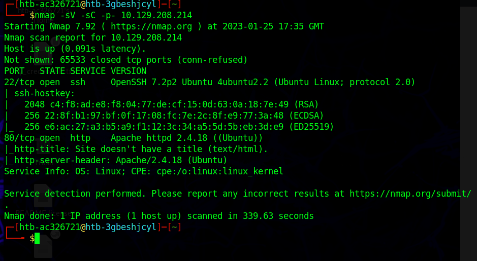

# Nibbles HTB Walkthrough

.png>)

Nibbles was the first full-blown attack box in HTB Academy that they had us attack. While the machine is considered to be retired and doesn't yield any points toward your actual HTB progression on the main site, they are great for practice and honing skills nonetheless. Completing these machines with the help of walkthroughs such as this one is a vital part of understanding the pentesting methodolgy and soon enough, these steps will become like second-nature. The more boxes you complete along the way, you'll get into a certain groove and immediately know what to look for when presented with a certain vulnerability.&#x20;

A secondary purpose of this writeup is to continue to build on my report writing skills and also express what we are actually doing to this box. One of my shortcomings is being able to speak at a technical level why we are carrying out certain attacks or why certain services may be vulnerable (you know, what pentesters have to do everyday). I've found that the best way for information to stick with me is to teach someone else what you are trying to learn, as I'm sure countless others have said.

I'll be using HTB's pwnbox since nothing too crazy is required to complete this one. Lets get it:

## Service Scanning

No matter what learning resource you use, when it comes to attacking boxes 99.99% of the time we are starting with nmap. This has become my go-to script for most of these beginning engagements since we don't have to worry about being noisy. This will give us ports and versions.&#x20;

nmap -sV -sC -p- \<ip>

We see we have port 22 and 80 open running on Apache 2.4.18. Lets visit the site to see if there is anything there.&#x20;

## Web Footprinting

Visiting the site we see we just have Hello World. If we view the source code though...

.png>)

We get a nibbleblog direcotry. Lets navigate to that:

.png>)

Looks like a blog posting page. A google search tells me that nibbleblog is a free blog posting system.&#x20;

## Directory Busting

Since theres not a lot to work with on the blog, lets see if there are any hidden directories that we can view. We'll use gobuster and a common wordlsit that should be included with most versions of Kali and other distros.&#x20;

gobuster dir -u http://\<ip>/nibbleblog/ --wordlist /usr/share/dirb/wordlists/common.txt

.png>)

/admin and /admin.php could defintely be something. /admin.php is giving us a 200 OK code.

.png>)

Looks like we'll need a username and password to access. A great practice is to leave no stone unturned. Lets navigate through these other directories that gobuster gave us and see if there is anything valuable that may lead us to credentials.&#x20;

## Getting Credentials

In our travels we stumble across users.xml which gives us some hard coded credentials right in plane site. username = admin. This is also telling us that it will blacklist our ip after too many fails, so brute-forcing to get the password is out of the question. Like many others, I myself had to ask for help on this one and refer to other walkthroughs. The password is "nibbles", a simple play on words of the blog that could be guessed since it's considered a weak password.&#x20;

## Logging in as Admin

We log in as admin and get to the nibbleblog dash.&#x20;

.png>)

Backtracking a little, we go back to the gobuster results and see a /README directory that could give us clues about this admin page.&#x20;

.png>)

We get a version number. Since nibbleblog is free and widely used, it more than likely has a previously exploited vulnerability that we can leverage. A little searchsploit to confirm:

.png>)

Seems like we are on the right track. Lets spin up Metasploit.&#x20;

## Initial Foothold

There are several manual ways to gain your initial foothold including uploading a reverse shell as a php file into the my image plugin (the same path we will be taking w/ metasploit). I will probably revise this later with more manual methods, but for lets take advantage of the tools we have at our disposal.

A search on Metasploit gives us the File Upload exploit we got with Searchsploit. Lets see what parameters we need first before we run with show options:

We'll set each required parameter with the info we've gathered from our previous phases:

.png>)

Note: LHOST will be your tun0 IP, just do an ifconfig. Also a lot of walkthroughs will skip over setting the TARGETURI to the directory that you are trying to exploit; good practice in the future as well.&#x20;

Once we have a shell we can simply type "shell" to give us another session where we can run commands more easily. Then we just navigate around to get the user.txt

.png>)

## Privelege Escalation

Now that we are in a session as Nibbler, lets see if we can run anything as root:

sudo -l&#x20;

.png>)

So we can run monitor.sh with root permissions. We know that the root flag is going to be a file called root.txt by default.&#x20;

echo "ls /root/ > /home/nibbler/personal/stuff/root.txt" > monitor.sh

.png>)

We've made it to where root.txt lies within monitor.sh, which we know we can run with root permissions without providing a password.&#x20;

So instead of ls, lets use cat&#x20;

echo "cat /root/root.txt > /home/nibbler/personal/stuff/root.txt" > monitor.sh

This allows us to view the contents of root.txt and get the root flag.

## Conclusion

While I have pwn'd a few active machines on HTB, this box was a very good refresher and a perfect example of how the pentesting methodology flows. We were able to:

1. Gather information on the target
2. Found vulnerable technologies&#x20;
3. Discovered/prepared our exploit gathered information
4. Gained an initial foothold on the target
5. Maneuvered and escalated priveleges to complete the objective

This the first of many writeups that I hope to publish to sharpen my skills during my OSCP journey. Any feedback is more than welcome. Cheers and thank you for reading!
